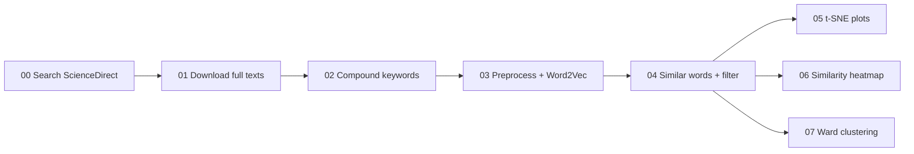

# Recommender systems and reinforcement learning for human-building interaction and context aware support: A text mining-driven review of scientific literature

[](https://doi.org/10.1016/j.enbuild.2024.115247)
[](https://arxiv.org/abs/2411.08734)
[](LICENSE)
[](http://creativecommons.org/licenses/by/4.0/)

Companion code for a text-mining review of recommender systems and reinforcement learning (RL) in human–building interaction and occupant context-aware support.

> Wenhao Zhang, Matias Quintana, Clayton Miller.  
> *Recommender systems and reinforcement learning for human-building interaction and context aware support: A text mining-driven review of scientific literature.*  
> *Energy and Buildings*, 329, 115247, 2025.  
> [doi:10.1016/j.enbuild.2024.115247](https://doi.org/10.1016/j.enbuild.2024.115247) · [arXiv:2411.08734](https://arxiv.org/abs/2411.08734)

This repository contains the Jupyter notebooks used to retrieve ScienceDirect literature, preprocess full texts, train a Word2Vec embedding model, and cluster related terms.

## Highlights

- **Corpus:** 27,595 articles retrieved from ScienceDirect.
- **Methods:** NLTK preprocessing, compound-keyword dictionaries, Word2Vec embeddings, cosine similarity filtering, t-SNE, and Ward hierarchical clustering.
- **Findings:** Recommender systems and RL are widely used for space/location recommendation and personalized control, but remain limited for indoor-environment and energy-efficiency optimization.
- **Algorithms:** Traditional recommenders (collaborative filtering, content-based, knowledge-based) are common; indoor and energy optimization more often rely on RL and deep learning.
- **Outlook:** Opportunities include predictive maintenance, building-related product recommendation, and environment optimization for sleep and productivity.

## Pipeline



Notebooks are numbered and should be run in order. Several later notebooks expect a trained `word2vec_model.model` and filtered CSV files produced by earlier steps.

| Notebook | Description |
| --- | --- |
| [`00_elsevier_search_from_sciencedirect.ipynb`](00_elsevier_search_from_sciencedirect.ipynb) | Query the Elsevier ScienceDirect Search API (by year, 2000–2024) and save DOI / year / title to CSV. |
| [`01_elsevier_download_sciencedirect_full_texts.ipynb`](01_elsevier_download_sciencedirect_full_texts.ipynb) | Deduplicate records and download article JSON via the Article Retrieval API. |
| [`02_extract_keywords_and_generate_compound_word_dictionary.ipynb`](02_extract_keywords_and_generate_compound_word_dictionary.ipynb) | Extract multi-word author keywords and write `compound_keywords.py`. |
| [`03_nltk_text_processing_and_train_word2vec_model.ipynb`](03_nltk_text_processing_and_train_word2vec_model.ipynb) | Tokenize full texts and train Word2Vec (`vector_size=300`, `window=20`, `min_count=2`). |
| [`04_word2vec_model_extract_and_filter_similar_words.ipynb`](04_word2vec_model_extract_and_filter_similar_words.ipynb) | Retrieve nearest neighbors and filter terms by average cosine similarity. |
| [`05_plot_word_vector_representation.ipynb`](05_plot_word_vector_representation.ipynb) | Project embeddings with t-SNE and plot category-wise word vectors. |
| [`06_word_similarity_heatmap.ipynb`](06_word_similarity_heatmap.ipynb) | Compute pairwise similarities and draw heatmaps. |
| [`07_wards_hierarchical_agglomerative_clustering.ipynb`](07_wards_hierarchical_agglomerative_clustering.ipynb) | Cluster selected word vectors with Ward linkage and save dendrograms. |

## Setup

The notebooks were developed with **Python 3.10**. A conda or venv environment is recommended.

```bash
pip install pandas numpy scipy matplotlib seaborn scikit-learn nltk gensim requests xmltodict jupyter
python -c "import nltk; nltk.download('punkt'); nltk.download('stopwords'); nltk.download('wordnet')"
```

### Elsevier API credentials

Notebooks `00` and `01` call Elsevier APIs and import a local `credentials.py` (not committed). Create it in the repository root:

```python
keys = {
    "els-apikey": "YOUR_API_KEY",
    "els-inst-token": "YOUR_INSTITUTIONAL_TOKEN",
}
```

Full-text download requires an Elsevier API key and, typically, an institutional token with ScienceDirect entitlements. See the [ScienceDirect Search API](https://dev.elsevier.com/documentation/ScienceDirectSearchAPI.wadl) and [Article Retrieval API](https://dev.elsevier.com/documentation/ArticleRetrievalAPI.wadl).

### Local paths

Some cells use placeholder paths such as `/.../downloaded_articles` or `/.../filtered_data_alg.csv`. Replace these with your local directories before running. Typical artifacts:

| Artifact | Produced by |
| --- | --- |
| `csv/sciencedirect_search_results.csv` | 00 |
| `elsevier_search_results_cleaned.csv` | 01 |
| `downloaded_articles/*.json` | 01 |
| `compound_keywords.py` | 02 |
| `word2vec_model.model` | 03 |
| `filtered_data_*.csv` | 04 |
| clustering / t-SNE figures | 05–07 |

## Citation

If you use this repository or the associated analysis, please cite:

```bibtex
@article{ZHANG2024115247,
  title   = {Recommender systems and reinforcement learning for human-building interaction and context aware support: A text mining-driven review of scientific literature},
  author  = {Wenhao Zhang and Matias Quintana and Clayton Miller},
  journal = {Energy and Buildings},
  volume  = {329},
  pages   = {115247},
  year    = {2025},
  issn    = {0378-7788},
  doi     = {10.1016/j.enbuild.2024.115247}
}
```

Preprint: [arXiv:2411.08734](https://arxiv.org/abs/2411.08734).

## License

- **Code:** [MIT](LICENSE) © 2024 Building and Urban Data Science (BUDS) Group
- **Text and figures:** [CC BY 4.0](http://creativecommons.org/licenses/by/4.0/)

## Contact

[Building and Urban Data Science (BUDS) Lab](https://www.budslab.org/), Department of the Built Environment, National University of Singapore.
